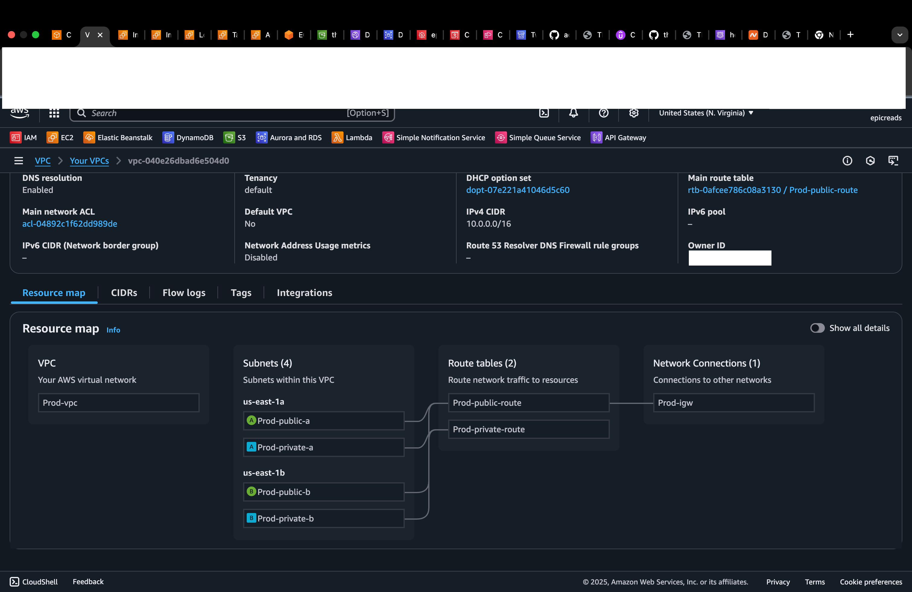
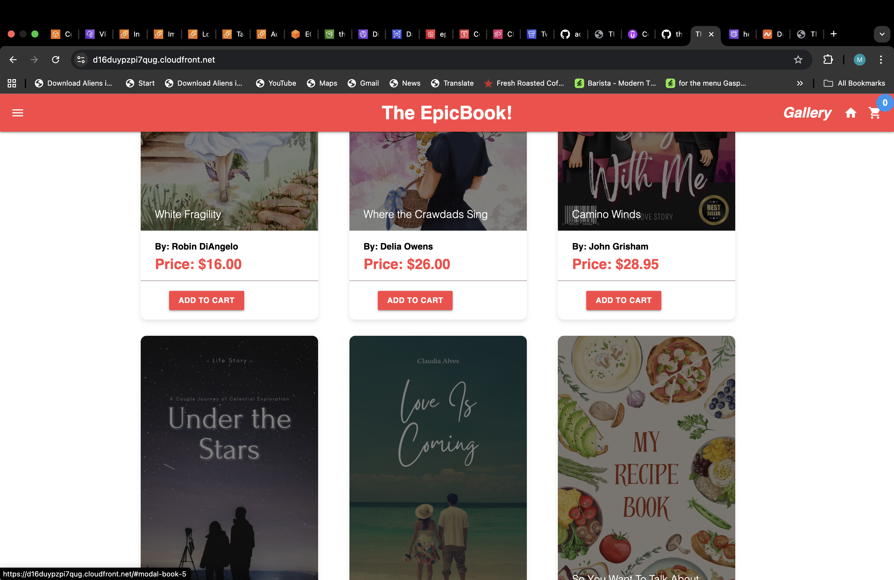

## TWO TIER WEB APPLICATION LIFT AND SHIFT FROM ON PREMISE TO AWS

## INTRO

This is a node.js application "The EpicBook". This application was lifted from GitHub and shifted to AWS. Deploying it as a **two-tier application** so as to keep the web server separate from the database. This is to ensure that the application is **scalable, secure, and highly available**.

## ARCHITECTURE OVERVIEW

I deployed a two-tier architecture on AWS, placed in a **custom VPC** with proper **security groups** and **subnets for isolation**. The application is designed to be **stateless** and **highly scalable**. For the Webserver, I used an **EC2 Instance** inside a **public subnet** that only allows traffic on port 80 from the **Application Load Balancer**. For the DataBase, I used **Amazon RDS MySQL**, placed inside a **private subnet** which only allows traffic on port 3306 from the webserver's security group. Static contents were offloaded to **S3** and distributed globally via **CloudFront** for low-latency delivery.


## CHALLENGES:

The Node.js app cloned from GitHub wasn't production-ready as crucial details like database credentials were **hardcoded**. The core solution was to modify the application code to be **stateless and secure** by fetching credentials dynamically at runtime. This required updating the application to use the **AWS Secrets Manager SDK** to retrieve database credentials. The configured version of the app was then used to create a **Golden AMI**, which ensures every new EC2 instance launched by the Auto Scaling Group is immediately production-ready. This approach requires an **IAM Role** attached to the EC2 instances to grant them permission to access Secrets Manager.


## Behind The Epic Book Project

What started as a simple lift and shift deployment became a deep dive into real world cloud engineering. This project pushed me beyond tutorials and into production level problem solving; configuring EC2 launch templates, RDS integration, Secrets Manager, Auto Scaling, and Load Balancing from scratch, while also keeping best practice in mind. Every failed deployment and every connection error taught me how AWS truly works under the hood.

From debugging stubborn user data scripts to aligning Route 53 and ACM validation, this wasn’t just a technical exercise, it was a lesson in patience, structure, and persistence. This two tier application isn’t just a deployed web app; it’s the proof of endurance behind every “stack update complete.”


## Tech Stack

- **AWS Services:** VPC, EC2, IAM, RDS, Secrets Manager, S3, CloudFront, Route 53, AWS Certificate Manager (ACM), CloudWatch, SNS, CodePipeline, CloudFormation
- **Tools:** AWS CLI, Git, GitHub
 
## Implementation Instructions

1. Create an Ec2 Instance (I used Ubuntu). This instance will serve for **manual configuration** and preparation of the "Golden AMI."
2. SSH to the instance on your terminal or directly from AWS console and run the following commands.

```bash
# update
sudo apt update && sudo apt upgrade -y

# essentials
sudo apt install -y git nginx build-essential

# Install MySQL CLI tool needed to connect to RDS
sudo apt install -y mysql-client-core-8.0

# Install Node.js LTS (Node 18 example)
curl -fsSL [https://deb.nodesource.com/setup_18.x](https://deb.nodesource.com/setup_18.x) | sudo -E bash -
sudo apt-get install -y nodejs

# Confirm node/npm
node -v && npm -v

# clone repo
cd /home/ubuntu
git clone https://github.com/pravinmishraaws/theepicbook.git
cd theepicbook

# install node deps
npm install

# install secret manager sdk
npm install @aws-sdk/client-secrets-manager

# Install PM2 globally to run Node app in background
sudo npm install -g pm2
pm2 start server.js --name theepicbook
pm2 status

# configure PM2 to auto start after reboot
pm2 startup systemd
# Follow the printed instructions, usually something like:
sudo env PATH=$PATH:/usr/bin pm2 startup systemd -u ubuntu --hp /home/ubuntu
pm2 save

# configure Nginx reverse proxy
# Install nginx
sudo apt update
sudo apt install -y nginx

# Start and enable nginx
sudo systemctl start nginx
sudo systemctl enable nginx

sudo nano /etc/nginx/sites-available/theepicbook

#paste this inside the new file
```nginx
server {
    listen 80;

    server_name _;

    location / {
        proxy_pass http://127.0.0.1:8080;   # Node.js app port
        proxy_http_version 1.1;
        proxy_set_header Upgrade $http_upgrade;
        proxy_set_header Connection 'upgrade';
        proxy_set_header Host $host;
        proxy_cache_bypass $http_upgrade;
    }
}
save and exit.

# Link to sites-enabled
sudo ln -s /etc/nginx/sites-available/theepicbook /etc/nginx/sites-enabled/

# Test config
sudo nginx -t

# Restart nginx
sudo systemctl restart nginx

```

3. Update Database Connection: This is the critical step. Update the database connection file (e.g., models/index.js) to fetch database credentials from Secrets Manager and initialize Sequelize with them instead of relying on the hardcoded config/config.json.

4. Prepare Environment Variables for Automation: After updating the database connection, prepare your shell profile.

```bash

export USE_SECRETS_MANAGER=true
export DB_SECRET_NAME=<SECRET MANAGER NAME>
export AWS_REGION=<YOUR_REGION>

```

**Side Note:** You can test this setup (including RDS, Secrets Manager, and IAM Role) locally by creating a temporary RDS database, manually seeding it, and running

```bash
npm start 
```
to confirm the application functions end-to-end before proceeding to the final deployment.

Ensure your environment variable is setup for testing you can manually do this by following the instruction below. But for automation you should use userdata to set the environment variable

```bash
# open your bash profile
nano ~/.bashrc

# add these lines at the end
export USE_SECRETS_MANAGER=true
export DB_SECRET_NAME=<SECRET MANAGER NAME>
export AWS_REGION=<YOUR_REGION>

# reload the profile to apply immediately
source ~/.bashrc
```

5. Create an AMI from the configured instance. This **"Golden AMI"** will be used as the image source for the full production. After this, you can delete the configuration instance and any other resources you created for testing.

6. Write the CloudFormation Template for the set up. I have attached a file for the template in `two-tier-app.yaml`.

## Crucial Note on Automation

The web application requires dynamic values (DB_SECRET_NAME and AWS_REGION) to fetch database credentials from Secrets Manager. Since the Auto Scaling Group (ASG) launches instances automatically, these variables cannot be set manually.

**The automation handles this in two layers:**

1. AMI Preparation (One-Time): The CloudFormation WebServerApp instance's User Data script runs once. Its primary job is to permanently inject the dynamic environment variables into the /home/ubuntu/.bashrc file. This ensures the variables are baked into the Golden AMI.

2. ASG Runtime (Every Launch): Every instance launched by the ASG uses the pre-configured PM2 systemd service (pm2-ubuntu.service). When this service starts, it sources the /home/ubuntu/.bashrc profile, automatically loading the required variables into the application's environment. The application is immediately production-ready without any further intervention.

The reliance on a specific secondary AMI was to ensure the Launch Template only includes the minimum required runtime setup (Nginx/PM2 start) and not any one-time configuration tasks, e.g, loading schema and seed files.

## Deployment Strategy: Two-Phase CloudFormation

**Phase 1 (Database and AMI Preparation):** The CloudFormation stack is initially deployed using the **Golden AMI**. The stack deployment is paused/stopped after the AppDataBase and the WebServerApp instance (the one-time seeding instance) are created. This ensures the database is seeded and the environment variables are correctly persisted to the instance.

**Manual Step (Post-Phase 1):** An AMI snapshot is manually taken from the running and configured WebServerApp instance. This new, finalized image is referred to as the **Secondary AMI**.

**Phase 2 (Production Scaling):** The CloudFormation template is updated to use the **Secondary AMI** in the WebServerLaunchTemplate. The stack is then deployed/updated fully, creating the Load Balancer, Auto Scaling Group, and CloudFront distribution for horizontal scaling and high availability.

## Important Note: 
I used GitHub and CodePipeline for Automated Deployment. I update my code to GitHub, and CodePipeline pushes to CloudFormation, which in turn creates and updates the resources.


## Understanding the cloudformation template

Here is a brief rundown of the Resources created in `two-tier-app.yaml` and why.

1. **VPC**: The whole application was created inside a custom and isolated VPC for tight security.

- **Subnets**: Private and Public Subnets were created in two Availability Zones. The Webserver is hosted on the public subnet, and the Database is hosted on the private subnet.

- **Internet Gateway**: An IGW attached to the VPC is created from the public subnet to allow the webserver communicate with the internet.

- **Route Tables**:  created a public route table (attached to the IGW and associated with the public subnets) and a private route table (associated with the private subnets).



2. **IAM**: An IAM Role was created to give EC2 permission to access Secrets Manager. Separate roles were created for CodePipeline and CloudFormation to manage auto-deployment permissions.

3. **EC2**: I created an instance for our web application using a pre-configured ami and a configured user data to retrieve the secrets manager credential of our database and load the schema and seed tool after rds is created and ready.

- **Security Groups**: 
a. A security group for the EC2 instance with SSH access and HTTP access that only allows traffic from the Load Balancer's security group on port 80.
b. A Database security group which only allows MySQL access from the Webserver's security group.
c. A Load Balancer security group with HTTP access listening on port 80.

- **Launch Template**: With a configured User Data script to start Nginx and the Node.js app via PM2 on boot.

- **Auto Scaling Group**: Connected to the Launch Template and the ALB for scaling the application and ensuring High Availability.


- **Application Load Balancer**: Distributes incoming loads across all running instances via a Target Group to ensure scalability.


4. **Amazon RDS**: This served as the second tier of the application. This is the database where the schema and seeding data were offloaded to. This database is configured to be isolated and private only allwoing traffic from the instance security group and only communicating to the secret manager for storing database credentials.


5. **Secret Manager**: This AWS service was used specifically to store database credentials for safety and security measures and only allows the instance to read these credentials with the configuration of an IAM role attached to the instance.

6. **S3Bucket**: An S3 Bucket was created to offload static contents from the instances. This bucket was configured with Origin Access Identity (OAI) policies to ensure high security and privacy (content is only available via CloudFront).

7. **CloudFront**: A CloudFront distribution was created as the global entry point to fetch the static content from the S3 Bucket and the dynamic site from the ALB DNS, delivering the application securely and globally with low latency.



8. **Route 53/ACM**: (Optional, but recommended) A Hosted Zone was created to manage the custom domain. The application traffic from CloudFront was then pointed to this domain. An ACM certificate was issued and linked to CloudFront to enforce HTTPS traffic for added security.


9. **CloudWatch**: I used CloudWatch for monitoring and logging, including the creation of alarms linked to the ASG's scaling policies.

10. **SNS**: I used SNS as a notification system connected to Cloudwatch to send out notifications for Auto Scaling Group
